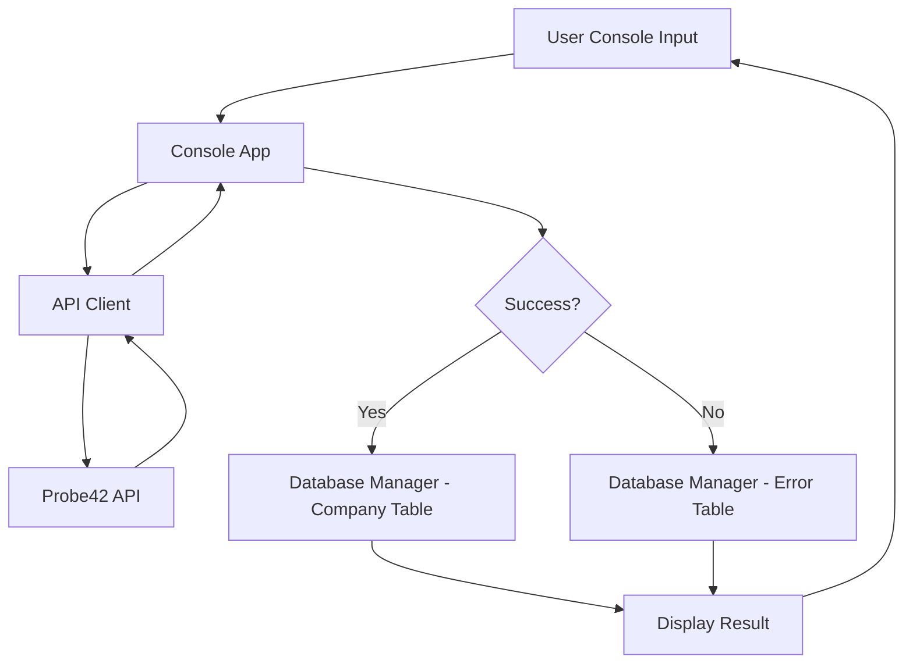

# Design Document: Probe42 Company Data Console

## Overview

This application is a Python console tool that queries the Probe42 API for company comprehensive details using a CIN number, stores company information (CIN, PAN, company name) in a MySQL `companies` table, and logs all API errors in a separate `error_logs` table. The application uses the `requests` library for HTTP calls and `mysql-connector-python` for database operations.

## Architecture



The application follows a simple layered architecture:
1. **Console Layer** - Handles user input/output
2. **API Client Layer** - Manages HTTP requests to Probe42
3. **Database Layer** - Handles MySQL connections and CRUD operations

## Components and Interfaces

### 1. API Client (`api_client.py`)

```python
class Probe42Client:
    BASE_URL = "https://api.probe42.in/probe_pro_sandbox/companies"
    API_KEY = "Tw7mc8TzlX63z2fP3gul4aBgLWvDmSOu6LDVBDacU18"

    def fetch_company_details(self, cin: str) -> dict:
        """
        Fetches comprehensive details for a company.
        Returns dict with keys: success (bool), data (dict or None), error (dict or None)
        On success: {"success": True, "data": {"cin": ..., "pan": ..., "company_name": ...}}
        On error: {"success": False, "error": {"code": int, "message": str}}
        """
```

### 2. Database Manager (`db_manager.py`)

```python
class DatabaseManager:
    def __init__(self, host="127.0.0.1", port=3306, user="root", password="Root@123"):
        ...

    def initialize(self) -> None:
        """Creates database and tables if they don't exist."""

    def insert_company(self, cin: str, pan: str, company_name: str) -> None:
        """Inserts or updates company record."""

    def insert_error(self, error_code: int, error_message: str, cin: str) -> None:
        """Inserts error log entry with timestamp."""

    def close(self) -> None:
        """Closes database connection."""
```

### 3. Console App (`main.py`)

```python
def main():
    """Main loop: prompt for CIN, fetch data, store results, display output."""
```

## Data Models

### Company Table (`companies`)

| Column       | Type         | Constraints          |
|-------------|-------------|---------------------|
| id          | INT          | PRIMARY KEY, AUTO_INCREMENT |
| cin         | VARCHAR(21)  | UNIQUE, NOT NULL     |
| pan         | VARCHAR(10)  | NULL                 |
| company_name| VARCHAR(255) | NOT NULL             |
| created_at  | TIMESTAMP    | DEFAULT CURRENT_TIMESTAMP |
| updated_at  | TIMESTAMP    | ON UPDATE CURRENT_TIMESTAMP |

### Error Table (`error_logs`)

| Column        | Type         | Constraints          |
|--------------|-------------|---------------------|
| id           | INT          | PRIMARY KEY, AUTO_INCREMENT |
| error_code   | INT          | NOT NULL             |
| error_message| VARCHAR(255) | NOT NULL             |
| cin_queried  | VARCHAR(21)  | NOT NULL             |
| created_at   | TIMESTAMP    | DEFAULT CURRENT_TIMESTAMP |

### Error Code Mapping

| HTTP Code | Error Message |
|-----------|--------------|
| 400 | Bad Request - Invalid URL |
| 403 | Forbidden - no api-key supplied, incorrect api-key or incorrect URL |
| 422 | Validation error - wrong CIN format |
| 404 | Resource not found |
| 429 | Credits not sufficient |
| 500 | Server side error |
| 502 | Timeout error - backend system issue |
| 504 | AWS gateway timeout |


## Correctness Properties

*A property is a characteristic or behavior that should hold true across all valid executions of a system—essentially, a formal statement about what the system should do. Properties serve as the bridge between human-readable specifications and machine-verifiable correctness guarantees.*

### Property 1: Company data round-trip

*For any* valid company data (CIN, PAN, company name), inserting it into the Company_Table and then querying by CIN should return the same PAN and company name that was inserted.

**Validates: Requirements 2.2**

### Property 2: Upsert idempotence

*For any* CIN number and two different sets of company data (PAN, name), inserting the first set then inserting the second set with the same CIN should result in exactly one record in the Company_Table, containing the second set's values.

**Validates: Requirements 2.4**

### Property 3: Error code mapping correctness

*For any* known HTTP error code from the set {400, 403, 404, 422, 429, 500, 502, 504}, the error mapping function should return the corresponding predefined error message string.

**Validates: Requirements 3.2, 3.3, 3.4, 3.5, 3.6, 3.7, 3.8, 3.9**

### Property 4: Database initialization idempotence

*For any* number of consecutive calls to the database initialization function, the database and tables should exist and no errors should be raised. Calling initialize() N times should be equivalent to calling it once.

**Validates: Requirements 5.1, 5.2, 5.3**

### Property 5: Error logging round-trip

*For any* error code, error message, and CIN string, inserting an error log entry and then querying the most recent entry for that CIN should return the same error code and message.

**Validates: Requirements 3.1**

## Error Handling

| Scenario | Handling |
|----------|----------|
| Network timeout / connection error | Display "Connection error: unable to reach API" and log to error table with code 0 |
| Invalid CIN format (client-side) | Display warning before making API call |
| MySQL connection failure | Display "Database connection failed" and exit gracefully |
| Unknown HTTP error code | Log with generic message "Unknown error" and the actual status code |

## Testing Strategy

### Unit Tests
- Test error code mapping function with each known code
- Test API client URL construction
- Test header configuration
- Test database SQL generation for table creation

### Property-Based Tests

Library: **Hypothesis** (Python property-based testing framework)

Configuration:
- Minimum 100 examples per property test
- Each test annotated with: `# Feature: probe42-company-data, Property N: <title>`

Tests:
1. **Property 1** - Generate random (CIN, PAN, name) tuples, insert, query, verify equality
2. **Property 2** - Generate random CIN with two different (PAN, name) pairs, insert both, verify single record with latest values
3. **Property 3** - Select random codes from the known set, verify mapping output matches expected
4. **Property 4** - Call initialize() a random number of times (1-5), verify no exceptions
5. **Property 5** - Generate random error entries, insert, query, verify round-trip

### Integration Tests
- End-to-end test with a mocked API response flowing through to database storage
- Verify error responses are correctly logged
